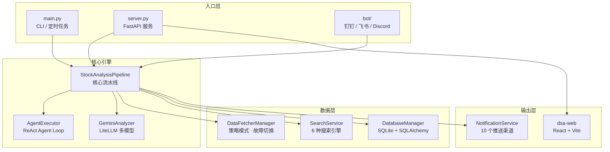
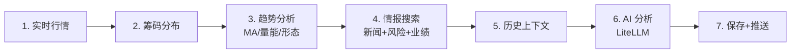
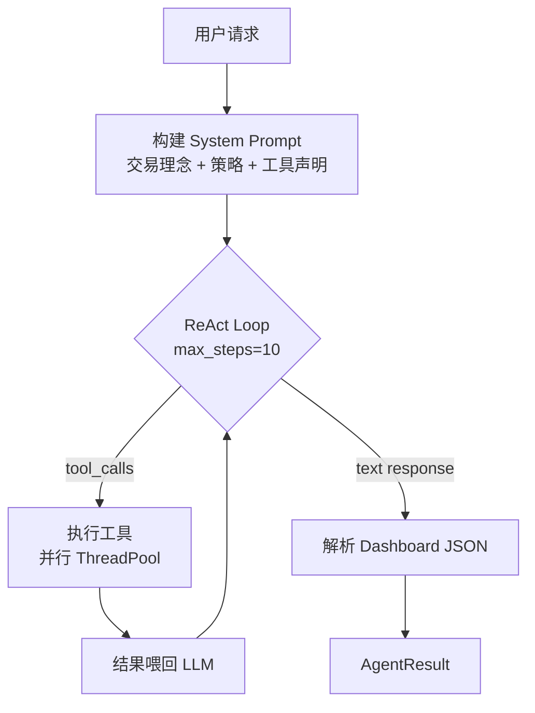
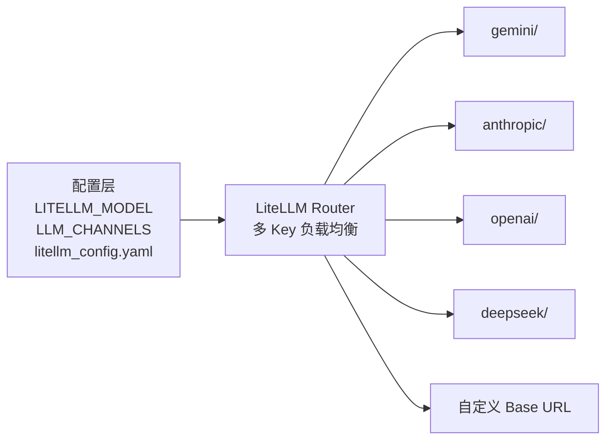
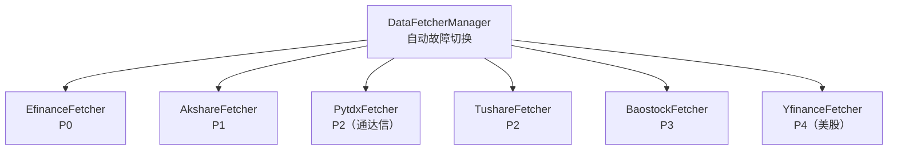
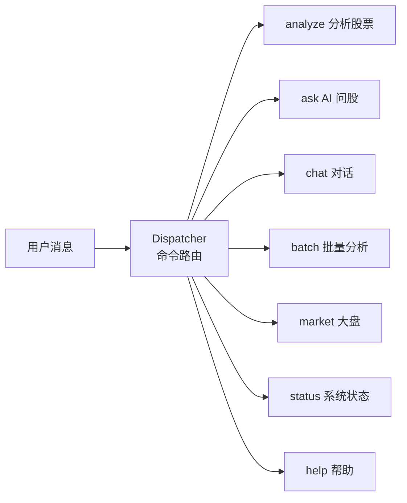
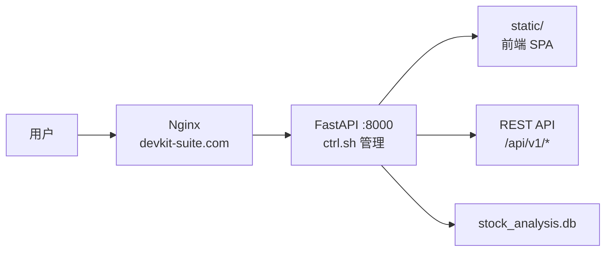

# Daily Stock Analysis — 架构与实现文档

> A股/港股/美股自选股智能分析系统，融合多数据源、AI Agent、多渠道推送的全栈量化决策平台。

## 系统总览



---

## 1. 入口层

| 入口 | 文件 | 说明 |
|------|------|------|
| CLI | [main.py](file:///Users/robin/myworkdir/daily_stock_analysis/main.py) | 主调度程序，支持 4 种运行模式 |
| FastAPI | [server.py](file:///Users/robin/myworkdir/daily_stock_analysis/server.py) | uvicorn 独立启动入口 |
| WebUI | [webui.py](file:///Users/robin/myworkdir/daily_stock_analysis/webui.py) | WebUI 快捷启动脚本 |
| 服务门面 | [analyzer_service.py](file:///Users/robin/myworkdir/daily_stock_analysis/analyzer_service.py) | 统一服务接口（CLI/WebUI/Bot 共用） |
| 进程管理 | [ctrl.sh](file:///Users/robin/myworkdir/daily_stock_analysis/ctrl.sh) | start/stop/restart 管理脚本 |

### CLI 运行模式

```
python main.py                  # 单次全量分析
python main.py --schedule       # 定时任务模式
python main.py --market-review  # 仅大盘复盘
python main.py --webui          # 启动 Web 服务 + 分析
python main.py --serve-only     # 仅 Web 服务
python main.py --backtest       # 回测模式
```

---

## 2. 核心引擎

### 2.1 StockAnalysisPipeline — 核心流水线

**文件**: [src/core/pipeline.py](file:///Users/robin/myworkdir/daily_stock_analysis/src/core/pipeline.py) (1298 行)

分析一只股票的完整 7 步流程：



- **并发控制**: `ThreadPoolExecutor` 多股票并行，可配 `max_workers`
- **断点续传**: 检查当日数据是否已存在，跳过已完成的股票
- **交易日过滤**: 自动跳过休市市场的股票 (Issue #373)
- **Agent 模式**: 当 `agent_mode=true` 或配置了特定策略时，切换为 Agent 分析管线

### 2.2 AgentExecutor — ReAct Agent Loop

**文件**: [src/agent/executor.py](file:///Users/robin/myworkdir/daily_stock_analysis/src/agent/executor.py) (695 行)



**两种模式**:
- `run()` — 生成决策仪表盘 JSON（定时分析）
- `chat()` — 自由对话模式（问股页面），带会话历史管理

**Agent 工具注册表**: [src/agent/tools/registry.py](file:///Users/robin/myworkdir/daily_stock_analysis/src/agent/tools/registry.py)

| 工具 | 文件 | 功能 |
|------|------|------|
| `get_realtime_quote` | [analysis_tools.py](file:///Users/robin/myworkdir/daily_stock_analysis/src/agent/tools/analysis_tools.py) | 获取实时行情 |
| `get_daily_history` | [data_tools.py](file:///Users/robin/myworkdir/daily_stock_analysis/src/agent/tools/data_tools.py) | 获取历史K线 |
| `analyze_trend` | [analysis_tools.py](file:///Users/robin/myworkdir/daily_stock_analysis/src/agent/tools/analysis_tools.py) | 技术指标分析 |
| `get_chip_distribution` | [analysis_tools.py](file:///Users/robin/myworkdir/daily_stock_analysis/src/agent/tools/analysis_tools.py) | 筹码分布 |
| `search_stock_news` | [search_tools.py](file:///Users/robin/myworkdir/daily_stock_analysis/src/agent/tools/search_tools.py) | 新闻搜索 |
| `get_market_indices` | [market_tools.py](file:///Users/robin/myworkdir/daily_stock_analysis/src/agent/tools/market_tools.py) | 市场概览 |
| `get_sector_rankings` | [market_tools.py](file:///Users/robin/myworkdir/daily_stock_analysis/src/agent/tools/market_tools.py) | 板块排名 |

**交易策略 (Skills)**: [src/agent/skills/](file:///Users/robin/myworkdir/daily_stock_analysis/src/agent/skills) + [strategies/](file:///Users/robin/myworkdir/daily_stock_analysis/strategies)

11 种 YAML 策略可热加载：多头趋势、箱体震荡、底部放量、均线金叉、缠论、龙头策略、情绪周期、波浪理论等。

### 2.3 LLM 适配层

**文件**: [src/agent/llm_adapter.py](file:///Users/robin/myworkdir/daily_stock_analysis/src/agent/llm_adapter.py) + [src/config.py](file:///Users/robin/myworkdir/daily_stock_analysis/src/config.py)



- **模型配置优先级**: LITELLM_CONFIG YAML > LLM_CHANNELS 环境变量 > 单 Key 回退
- **多 Key 轮询**: 同一个提供商可配多个 API Key，自动负载均衡
- **回退模型**: `LITELLM_FALLBACK_MODELS` 支持逗号分隔的多级回退

---

## 3. 数据层

### 3.1 DataFetcherManager — 多数据源策略模式

**文件**: [data_provider/base.py](file:///Users/robin/myworkdir/daily_stock_analysis/data_provider/base.py) (1131 行)



| 数据源 | 文件 | 市场 | 特点 |
|--------|------|------|------|
| Efinance | [efinance_fetcher.py](file:///Users/robin/myworkdir/daily_stock_analysis/data_provider/efinance_fetcher.py) | A股/港股 | 最高优先级，支持实时行情+筹码 |
| AKShare | [akshare_fetcher.py](file:///Users/robin/myworkdir/daily_stock_analysis/data_provider/akshare_fetcher.py) | A股/港股 | 东财/新浪/腾讯三数据源 |
| PyTDX | [pytdx_fetcher.py](file:///Users/robin/myworkdir/daily_stock_analysis/data_provider/pytdx_fetcher.py) | A股 | 通达信行情接口 |
| Tushare | [tushare_fetcher.py](file:///Users/robin/myworkdir/daily_stock_analysis/data_provider/tushare_fetcher.py) | A股 | 需 Token |
| Baostock | [baostock_fetcher.py](file:///Users/robin/myworkdir/daily_stock_analysis/data_provider/baostock_fetcher.py) | A股 | 免费，延迟较高 |
| YFinance | [yfinance_fetcher.py](file:///Users/robin/myworkdir/daily_stock_analysis/data_provider/yfinance_fetcher.py) | 美股 | 美股/美股指数专用路由 |

**防封禁策略**: 随机延迟 (Jitter)、指数退避重试、数据源间自动降级切换

### 3.2 SearchService — 多引擎搜索

**文件**: [src/search_service.py](file:///Users/robin/myworkdir/daily_stock_analysis/src/search_service.py) (2012 行)

| 搜索引擎 | 特点 |
|----------|------|
| Bocha | 中文 AI 搜索，带 AI 摘要 |
| Tavily | AI/LLM 优化搜索 |
| SerpAPI | Google 搜索代理（知识图谱+精选回答） |
| Brave | 隐私友好搜索 |
| MiniMax | MiniMax Coding Plan 搜索 |
| SearXNG | 自建搜索引擎 |

- **多维度情报**: `search_comprehensive_intel()` 包含最新消息、风险排查、业绩预期等 5 个维度
- **多 Key 负载均衡**: 每个引擎支持多 Key 轮询 + 错误计数 + 熔断

### 3.3 DatabaseManager — 存储层

**文件**: [src/storage.py](file:///Users/robin/myworkdir/daily_stock_analysis/src/storage.py) (1632 行)

SQLite + SQLAlchemy ORM，单例模式。

| 表 | 模型 | 用途 |
|----|------|------|
| `stock_daily` | `StockDaily` | OHLCV + MA + 量比 |
| `news_intel` | `NewsIntel` | 新闻情报（URL 去重） |
| `analysis_history` | `AnalysisHistory` | 分析结果历史（含狙击点位） |
| `backtest_results` | `BacktestResult` | 单条回测结果（方向+收益+目标价命中） |
| `backtest_summaries` | `BacktestSummary` | 回测汇总统计 |
| `conversation_messages` | `ConversationMessage` | Agent 对话历史 |
| `llm_usage` | `LLMUsage` | LLM Token 用量审计 |

---

## 4. API 层

**文件**: [api/app.py](file:///Users/robin/myworkdir/daily_stock_analysis/api/app.py) + [api/v1/router.py](file:///Users/robin/myworkdir/daily_stock_analysis/api/v1/router.py)

FastAPI 应用工厂 + SPA 静态文件托管。

| 路由组 | 前缀 | 端点文件 | 功能 |
|--------|------|----------|------|
| Auth | `/api/v1/auth` | [auth.py](file:///Users/robin/myworkdir/daily_stock_analysis/api/v1/endpoints/auth.py) | 登录认证 |
| Agent | `/api/v1/agent` | [agent.py](file:///Users/robin/myworkdir/daily_stock_analysis/api/v1/endpoints/agent.py) | AI 问股接口 |
| Analysis | `/api/v1/analysis` | [analysis.py](file:///Users/robin/myworkdir/daily_stock_analysis/api/v1/endpoints/analysis.py) | 触发/查看分析 |
| History | `/api/v1/history` | [history.py](file:///Users/robin/myworkdir/daily_stock_analysis/api/v1/endpoints/history.py) | 历史记录查询 |
| Stocks | `/api/v1/stocks` | [stocks.py](file:///Users/robin/myworkdir/daily_stock_analysis/api/v1/endpoints/stocks.py) | 股票数据接口 |
| Backtest | `/api/v1/backtest` | [backtest.py](file:///Users/robin/myworkdir/daily_stock_analysis/api/v1/endpoints/backtest.py) | 回测管理 |
| System | `/api/v1/system` | [system_config.py](file:///Users/robin/myworkdir/daily_stock_analysis/api/v1/endpoints/system_config.py) | 系统配置管理 |
| Usage | `/api/v1/usage` | [usage.py](file:///Users/robin/myworkdir/daily_stock_analysis/api/v1/endpoints/usage.py) | Token 用量统计 |

### 服务层 (Services)

位于 [src/services/](file:///Users/robin/myworkdir/daily_stock_analysis/src/services)，15 个服务模块：

- `analysis_service.py` — 分析任务编排
- `history_service.py` — 历史记录管理（32KB，功能丰富）
- `backtest_service.py` — 回测服务（18KB）
- `task_queue.py` — 异步任务队列
- `agent_model_service.py` — Agent 模型管理
- `image_stock_extractor.py` — 图片中股票代码提取（Vision LLM）
- `import_parser.py` — 自选股导入解析
- `name_to_code_resolver.py` — 股票名称↔代码互查
- `system_config_service.py` — 运行时配置热更新

### 数据访问层 (Repositories)

位于 [src/repositories/](file:///Users/robin/myworkdir/daily_stock_analysis/src/repositories)：

- `analysis_repo.py` — 分析历史 CRUD
- `backtest_repo.py` — 回测数据 CRUD
- `stock_repo.py` — 股票数据 CRUD

---

## 5. 通知层

**文件**: [src/notification.py](file:///Users/robin/myworkdir/daily_stock_analysis/src/notification.py) (1791 行) + [src/notification_sender/](file:///Users/robin/myworkdir/daily_stock_analysis/src/notification_sender)

`NotificationService` 通过多重继承聚合 10 个 Sender：

| 渠道 | Sender 文件 | 说明 |
|------|-------------|------|
| 企业微信 | [wechat_sender.py](file:///Users/robin/myworkdir/daily_stock_analysis/src/notification_sender/wechat_sender.py) | Webhook + 长消息分块 + Markdown 转图片 |
| 飞书 | [feishu_sender.py](file:///Users/robin/myworkdir/daily_stock_analysis/src/notification_sender/feishu_sender.py) | Webhook + 富文本卡片 |
| Telegram | [telegram_sender.py](file:///Users/robin/myworkdir/daily_stock_analysis/src/notification_sender/telegram_sender.py) | Bot API + HTML 格式 + 长消息分块 |
| 邮件 | [email_sender.py](file:///Users/robin/myworkdir/daily_stock_analysis/src/notification_sender/email_sender.py) | SMTP + HTML 渲染 |
| Discord | [discord_sender.py](file:///Users/robin/myworkdir/daily_stock_analysis/src/notification_sender/discord_sender.py) | Bot Webhook |
| Pushover | [pushover_sender.py](file:///Users/robin/myworkdir/daily_stock_analysis/src/notification_sender/pushover_sender.py) | 手机/桌面推送 |
| PushPlus | [pushplus_sender.py](file:///Users/robin/myworkdir/daily_stock_analysis/src/notification_sender/pushplus_sender.py) | 国内推送服务 |
| Server酱3 | [serverchan3_sender.py](file:///Users/robin/myworkdir/daily_stock_analysis/src/notification_sender/serverchan3_sender.py) | 手机 APP 推送 |
| AstrBot | [astrbot_sender.py](file:///Users/robin/myworkdir/daily_stock_analysis/src/notification_sender/astrbot_sender.py) | AstrBot 平台 |
| 自定义 Webhook | [custom_webhook_sender.py](file:///Users/robin/myworkdir/daily_stock_analysis/src/notification_sender/custom_webhook_sender.py) | 通用 Webhook |

报告格式: Jinja2 模板 ([templates/](file:///Users/robin/myworkdir/daily_stock_analysis/templates))，支持详细/简报/企微三种格式。

---

## 6. Bot 集成

**文件**: [bot/](file:///Users/robin/myworkdir/daily_stock_analysis/bot)



| 平台 | 文件 | 接入方式 |
|------|------|----------|
| 钉钉 | [dingtalk.py](file:///Users/robin/myworkdir/daily_stock_analysis/bot/platforms/dingtalk.py) / [dingtalk_stream.py](file:///Users/robin/myworkdir/daily_stock_analysis/bot/platforms/dingtalk_stream.py) | Webhook + Stream 双模式 |
| 飞书 | [feishu_stream.py](file:///Users/robin/myworkdir/daily_stock_analysis/bot/platforms/feishu_stream.py) | Stream 模式 (lark-oapi) |
| Discord | [discord.py](file:///Users/robin/myworkdir/daily_stock_analysis/bot/platforms/discord.py) | Bot API |

命令系统: [bot/commands/](file:///Users/robin/myworkdir/daily_stock_analysis/bot/commands) — 8 个命令模块，统一的 `BaseCommand` 基类。

---

## 7. 前端

### dsa-web (React + TypeScript + Vite)

**目录**: [apps/dsa-web/](file:///Users/robin/myworkdir/daily_stock_analysis/apps/dsa-web)

| 页面 | 文件 | 功能 |
|------|------|------|
| 首页 | `HomePage.tsx` | 自选股管理 + 分析结果展示 |
| 问股 | `ChatPage.tsx` | AI 对话式股票分析 (32KB，功能丰富) |
| 回测 | `BacktestPage.tsx` | 回测结果可视化 |
| 设置 | `SettingsPage.tsx` | 系统配置管理 |
| 登录 | `LoginPage.tsx` | 认证 |

构建产物输出到 `static/`，由 FastAPI SPA 路由托管。

### dsa-desktop (Electron)

**目录**: [apps/dsa-desktop/](file:///Users/robin/myworkdir/daily_stock_analysis/apps/dsa-desktop) — 桌面客户端封装。

---

## 8. 配置系统

**文件**: [src/config.py](file:///Users/robin/myworkdir/daily_stock_analysis/src/config.py) (1343 行)

- `.env` 驱动（参考 [.env.example](file:///Users/robin/myworkdir/daily_stock_analysis/.env.example)，427 行）
- 运行时热更新: `SystemConfigService` + `ConfigRegistry`
- 配置分组: LLM、数据源、通知、调度、回测、Agent、搜索等 20+ 组

---

## 9. 其他关键模块

| 模块 | 文件 | 说明 |
|------|------|------|
| 趋势分析器 | [src/stock_analyzer.py](file:///Users/robin/myworkdir/daily_stock_analysis/src/stock_analyzer.py) (31KB) | MA 多头排列、乖离率、量能、买点信号评分 |
| 格式化器 | [src/formatters.py](file:///Users/robin/myworkdir/daily_stock_analysis/src/formatters.py) (21KB) | Markdown/HTML/企微格式转换 |
| 回测引擎 | [src/core/backtest_engine.py](file:///Users/robin/myworkdir/daily_stock_analysis/src/core/backtest_engine.py) (19KB) | 方向准确率 + 模拟交易 + 止盈止损命中 |
| 飞书文档 | [src/feishu_doc.py](file:///Users/robin/myworkdir/daily_stock_analysis/src/feishu_doc.py) | 生成飞书云文档 |
| MD 转图片 | [src/md2img.py](file:///Users/robin/myworkdir/daily_stock_analysis/src/md2img.py) | Markdown → 图片（企微推送用） |
| 交易日历 | [src/core/trading_calendar.py](file:///Users/robin/myworkdir/daily_stock_analysis/src/core/trading_calendar.py) | 多市场交易日判断 |
| 调度器 | [src/scheduler.py](file:///Users/robin/myworkdir/daily_stock_analysis/src/scheduler.py) | APScheduler 定时任务 |
| 认证 | [src/auth.py](file:///Users/robin/myworkdir/daily_stock_analysis/src/auth.py) | JWT Token 认证 |

---

## 10. 部署架构



- **Docker**: [docker/Dockerfile](file:///Users/robin/myworkdir/daily_stock_analysis/docker/Dockerfile) + [docker-compose.yml](file:///Users/robin/myworkdir/daily_stock_analysis/docker/docker-compose.yml)
- **构建脚本**: [scripts/](file:///Users/robin/myworkdir/daily_stock_analysis/scripts) — macOS / Windows 双平台

---

## 11. 代码量统计

| 组件 | 核心文件数 | 大致总行数 | 说明 |
|------|-----------|-----------|------|
| 配置 | 3 | ~2,700 | config.py + config_registry.py + config_manager.py |
| 分析引擎 | 4 | ~2,800 | pipeline.py + analyzer.py + stock_analyzer.py + market_analyzer.py |
| Agent | 5 | ~1,500 | executor.py + llm_adapter.py + factory.py + tools/* |
| 数据源 | 7 | ~3,800 | base.py + 5 fetchers + realtime_types.py |
| 搜索 | 1 | ~2,000 | search_service.py |
| 存储 | 1 | ~1,600 | storage.py |
| 通知 | 11 | ~2,500 | notification.py + 10 senders |
| API | 10 | ~1,200 | endpoints/* |
| Bot | 10 | ~800 | commands/* + platforms/* |
| 前端 | ~50 | ~3,000 | React/TypeScript |
| **合计** | **~102** | **~20,000** | |
