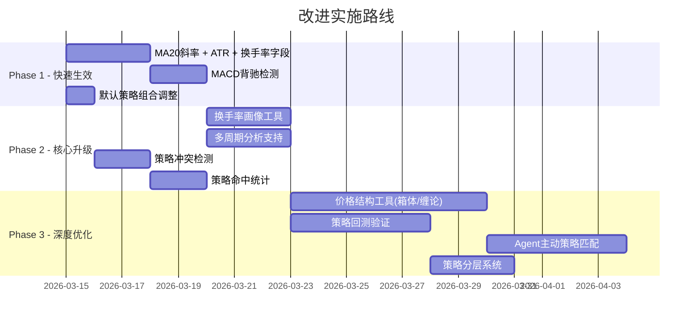

# Daily Stock Analysis — 系统改进方向方案

> 基于策略可行性分析和代码审查，提出系统性改进方案，分为 **工具增强、策略引擎升级、分析链路优化、运营与可观测性** 四大方向。

---

## 一、Agent 工具链增强

当前 `analyze_trend` 工具返回 18 个字段，覆盖了均线、乖离率、MACD、RSI、量能和支撑阻力。但多个策略引用的关键数据在工具链中缺失。

### 1.1 `analyze_trend` 增加 ATR 和换手率字段

**问题**：情绪周期策略 (`emotion_cycle`) 需要 ATR 判断波动率收缩，缩量回踩需要换手率辅助判断。当前工具不返回这两项。

**改动范围**：
- `src/stock_analyzer.py` — `TrendAnalysisResult` 新增字段 + 计算逻辑
- `src/agent/tools/analysis_tools.py` — 输出 dict 增加新字段

**新增字段**：

```python
# TrendAnalysisResult 新增
atr_14: float = 0.0                # 14日ATR（平均真实波幅）
atr_ratio: float = 0.0             # ATR / 现价 × 100（波动率百分比）
atr_trend: str = ""                # ATR走势：收缩/扩大/平稳
turnover_rate: float = 0.0         # 当日换手率 %
turnover_avg_5d: float = 0.0       # 5日平均换手率 %
turnover_avg_20d: float = 0.0      # 20日平均换手率 %
turnover_trend: str = ""           # 换手率趋势：升温/降温/平稳
```

**ATR 计算公式**：
```python
def _calculate_atr(self, df, period=14):
    high, low, close = df['high'], df['low'], df['close']
    tr = pd.concat([
        high - low,
        (high - close.shift(1)).abs(),
        (low - close.shift(1)).abs()
    ], axis=1).max(axis=1)
    return tr.rolling(window=period).mean()
```

**优先级**：⭐⭐⭐⭐⭐ （多个策略受益，改动成本低）

---

### 1.2 MACD 背驰检测工具

**问题**：缠论策略的核心步骤是"背驰判断"——价格创新高/新低但 MACD 柱面积缩小。当前 `macd_bar` 只返回最新一根柱值，无法比较连续两段行情的柱面积。

**改动方案**：在 `StockTrendAnalyzer` 中新增背驰检测方法，输出追加到 `TrendAnalysisResult`。

**新增字段**：
```python
macd_divergence: str = ""        # "顶背驰" / "底背驰" / "无"
macd_bar_area_recent: float = 0  # 最近一段红/绿柱面积
macd_bar_area_prev: float = 0    # 前一段红/绿柱面积
```

**检测逻辑**（伪代码）：
```python
def _detect_macd_divergence(self, df, result):
    bars = df['MACD_BAR'].values
    # Find zero-crossings to segment bar areas
    segments = split_by_zero_crossing(bars)
    if len(segments) < 2:
        result.macd_divergence = "无"
        return
    
    recent, prev = segments[-1], segments[-2]
    recent_area = sum(abs(b) for b in recent)
    prev_area = sum(abs(b) for b in prev)
    
    # Top divergence: price higher but bar area smaller (both positive)
    if all(b > 0 for b in recent) and all(b > 0 for b in prev):
        recent_high = max(df['high'].iloc[-len(recent):])
        prev_high = max(df['high'].iloc[-len(recent)-len(prev):-len(recent)])
        if recent_high > prev_high and recent_area < prev_area * 0.7:
            result.macd_divergence = "顶背驰"
    
    # Bottom divergence: price lower but bar area smaller (both negative)
    # ... symmetric logic
```

**优先级**：⭐⭐⭐⭐ （缠论/波浪策略核心依赖）

---

### 1.3 新增 `detect_structure` 工具 — 缠论/箱体自动识别

**问题**：缠论的"分型→笔→线段→中枢"和箱体策略的"箱体识别"依赖精确的极值点检测，这是 LLM 最弱的能力。应由代码算法完成。

**方案**：新建 `src/agent/tools/structure_tools.py`，实现价格结构分析工具。

**工具定义**：

```python
detect_structure_tool = ToolDefinition(
    name="detect_structure",
    description="Detect price structure: pivots, support/resistance boxes, "
                "and (optional) Chan Theory segments/hubs.",
    parameters=[
        ToolParameter(name="stock_code", type="string", ...),
        ToolParameter(name="mode", type="string",
                      description="'box' for box range, 'chan' for Chan Theory, 'pivots' for pivot points",
                      default="box"),
        ToolParameter(name="days", type="integer", default=120),
    ],
    handler=_handle_detect_structure,
)
```

**输出格式（box 模式）**：
```json
{
  "box_detected": true,
  "box_top": 25.80,
  "box_bottom": 23.50,
  "box_width_pct": 9.8,
  "touch_count_top": 4,
  "touch_count_bottom": 3,
  "current_zone": "箱底区域",
  "distance_to_top_pct": 8.2,
  "distance_to_bottom_pct": 1.5,
  "box_valid": true
}
```

**实现思路**（pivot point 算法）：
1. 使用 ZigZag 或 fractal 算法找到 K 线的局部极值
2. 对极值进行聚类（相近高/低点归为同一阻力/支撑线）
3. 统计触碰次数，判断箱体有效性
4. 扩展 chan 模式：引入 [czsc](https://github.com/waditu/czsc) 库做分型/笔/中枢

**优先级**：⭐⭐⭐ （高价值但开发量较大）

---

### 1.4 新增 `get_turnover_profile` 工具 — 换手率画像

**问题**：情绪周期策略需要"近一年换手率均值"对比、"连续换手率走势"等数据。现有工具不支持。

**方案**：

```python
def _handle_get_turnover_profile(stock_code: str, days: int = 250) -> dict:
    """Calculate turnover rate profile for sentiment cycle analysis."""
    # Fetch up to 250 days of data
    # Return:
    return {
        "code": stock_code,
        "current_turnover": 1.2,
        "avg_5d": 1.5,
        "avg_20d": 2.1,
        "avg_60d": 1.8,
        "avg_250d": 2.3,           # Full year average
        "percentile_in_year": 25,   # Current vs. annual range (0-100)
        "trend_20d": "降温",        # "升温" / "降温" / "平稳"
        "spike_detected": false,    # Single-day > 5x avg
        "consecutive_low_days": 8,  # Consecutive days below avg * 0.5
        "zone": "冷淡",            # "冷淡" / "平稳" / "活跃" / "过热"
    }
```

**优先级**：⭐⭐⭐⭐ （情绪周期策略的核心数据来源）

---

## 二、策略引擎升级

### 2.1 策略冲突检测

**问题**：同时启用"缩量回踩"（需要缩量）和"放量突破"（需要放量）时，对同一只股票可能产生矛盾信号。

**方案**：在 `SkillManager` 中新增冲突矩阵。

```python
# src/agent/skills/base.py

CONFLICT_MATRIX = {
    ("shrink_pullback", "volume_breakout"): "量能方向矛盾：缩量回踩 vs 放量突破",
    ("bull_trend", "bottom_volume"): "趋势方向矛盾：多头趋势 vs 底部反转",
}

def activate(self, skill_names: List[str]) -> None:
    # ... existing logic ...
    # Check conflicts
    active_set = set(s.name for s in self._skills.values() if s.enabled)
    for (a, b), reason in CONFLICT_MATRIX.items():
        if a in active_set and b in active_set:
            logger.warning(f"Strategy conflict detected: {reason}")
            # Could auto-disable one, or add a note to system prompt
```

**优先级**：⭐⭐⭐ （安全性改进）

---

### 2.2 策略回测验证

**问题**：11 个策略目前都是"理论可行"，没有历史数据验证。系统已有回测引擎 (`src/core/backtest_engine.py`)，应利用它对每个策略做胜率统计。

**方案**：新增批量策略回测命令。

```bash
python main.py --backtest-strategies \
    --strategies bull_trend,shrink_pullback,one_yang_three_yin \
    --stocks 600519,000858,300750 \
    --period 2024-01-01:2025-01-01
```

**输出**：

| 策略 | 总信号 | 胜率 | 平均收益 | 最大回撤 | 夏普比率 |
|------|-------|------|---------|---------|---------|
| bull_trend | 45 | 62% | +3.2% | -8.5% | 1.4 |
| shrink_pullback | 28 | 71% | +4.1% | -6.2% | 1.8 |

**优先级**：⭐⭐⭐⭐⭐ （最核心的长期改进——让数据说话）

---

### 2.3 调整默认策略组合

**当前默认**：`bull_trend`, `ma_golden_cross`, `volume_breakout`, `shrink_pullback`

**建议调整**：

```python
# src/agent/factory.py
DEFAULT_AGENT_SKILLS = [
    "bull_trend",           # 核心趋势框架 ✅
    "shrink_pullback",      # 最佳入场策略 ✅ (条件最精确)
    "one_yang_three_yin",   # 精确形态信号 ✅ (替换 ma_golden_cross)
    "volume_breakout",      # 突破策略 ✅
]
```

**理由**：
- `ma_golden_cross` 与 `bull_trend` 信号重叠度高（均线相关），且金叉滞后性严重
- `one_yang_three_yin` 条件高度量化、与趋势策略互补，且已有 `analyze_pattern` 工具支持类似形态检测
- 同时推荐增加 `emotion_cycle`（待 1.4 换手率工具完成后）

**优先级**：⭐⭐⭐⭐ （简单改一行代码，立即有效果）

---

### 2.4 策略分层系统

**问题**：当前所有策略权重相同，都是往 `sentiment_score` 上加减分。但不同策略的可靠性和适用场景差异巨大。

**方案**：在 `Skill` 数据类中新增 `confidence_weight` 和 `applicable_market` 字段。

```yaml
# chan_theory.yaml 追加
confidence_weight: 0.6     # 0-1，反映策略的LLM可执行精度
applicable_market:          # 适用市场条件
  - "trend"                 # 趋势市
  - "oscillation"           # 震荡市
not_applicable_market:
  - "crash"                 # 暴跌市慎用
```

System Prompt 注入时可据此生成权重提示：`此策略置信度中等(0.6)，建议结合其他策略验证。`

**优先级**：⭐⭐⭐ （中期改进）

---

## 三、分析链路优化

### 3.1 多周期分析支持

**问题**：缠论需要"日线+周线共振"，波浪理论需要"120日数据"，但 `_fetch_trend_data` 默认只取 89 天（约 60 个交易日）。

**方案**：

```python
# analysis_tools.py — analyze_trend 增加 timeframe 参数
ToolParameter(
    name="timeframe",
    type="string",
    description="'daily' (默认), 'weekly', 或 'monthly'",
    required=False,
    default="daily",
),
ToolParameter(
    name="days",
    type="integer",
    description="Number of days to fetch (default: 90, max: 365)",
    required=False,
    default=90,
),
```

周线数据处理：
```python
if timeframe == "weekly":
    df = df.resample('W', on='date').agg({
        'open': 'first', 'high': 'max', 'low': 'min',
        'close': 'last', 'volume': 'sum'
    }).dropna()
```

**优先级**：⭐⭐⭐⭐ （缠论/波浪的基础需求）

---

### 3.2 `analyze_trend` 输出增加 MA 斜率信息

**问题**：`bull_trend` 策略要求"MA20 斜率向上"，但当前只返回 MA20 的值，不返回斜率。

**实现**：
```python
# stock_analyzer.py — _analyze_trend 方法增加
if len(df) >= 10 and result.ma20 > 0:
    ma20_5d_ago = float(df.iloc[-6]['MA20'])
    result.ma20_slope = round((result.ma20 - ma20_5d_ago) / ma20_5d_ago * 100, 3)
    result.ma20_direction = "上行" if result.ma20_slope > 0.1 else "下行" if result.ma20_slope < -0.1 else "走平"
```

**优先级**：⭐⭐⭐⭐⭐ （改动极小，核心策略受益）

---

### 3.3 Agent 主动策略匹配

**问题**：当前策略是"一次性全部注入 prompt"，不管股票处于什么状态，LLM 都要阅读所有策略指令，增加 token 消耗和干扰。

**方案**：两阶段分析。

```
Phase 1: analyze_trend + get_realtime_quote
    → 获得趋势状态、量能状态
    → 代码自动筛选匹配策略

Phase 2: 只注入匹配的策略到 prompt
```

**匹配规则**：
```python
def match_strategies(trend_result) -> List[str]:
    matched = []
    # 多头趋势 → bull_trend, shrink_pullback, ma_golden_cross
    if trend_result.trend_status in [TrendStatus.BULL, TrendStatus.STRONG_BULL]:
        matched.extend(["bull_trend", "shrink_pullback"])
    # 缩量 → shrink_pullback
    if trend_result.volume_status == VolumeStatus.SHRINK_VOLUME_DOWN:
        matched.append("shrink_pullback")
    # 箱体 → box_oscillation
    if trend_result.trend_status == TrendStatus.CONSOLIDATION:
        matched.append("box_oscillation")
    # 空头底部 → bottom_volume
    if trend_result.trend_status in [TrendStatus.BEAR, TrendStatus.STRONG_BEAR]:
        matched.append("bottom_volume")
    return list(set(matched))
```

**效果**：
- 减少 prompt token 消耗（约 30-50%）
- 减少策略间的噪声干扰
- 提高匹配策略的执行深度

**优先级**：⭐⭐⭐ （架构级改动，中期目标）

---

## 四、运营与可观测性

### 4.1 策略命中统计

**问题**：无法知道哪个策略被实际使用、命中率如何。

**方案**：在 `AgentResult` 中记录策略命中情况，写入 `analysis_history` 表新增字段。

```sql
ALTER TABLE analysis_history ADD COLUMN matched_strategies TEXT;
-- JSON: ["bull_trend", "shrink_pullback"]
ALTER TABLE analysis_history ADD COLUMN strategy_scores TEXT;
-- JSON: {"bull_trend": +12, "shrink_pullback": +10}
```

通过 `/api/v1/usage/strategy-stats` 提供统计接口。

**优先级**：⭐⭐⭐⭐ （运营必备）

---

### 4.2 Agent Tool 调用监控

**问题**：不知道每次分析调用了哪些工具、耗时多少。

**方案**：`AgentExecutor` 已记录 `tool_calls`，只需增加耗时统计并写入 `llm_usage` 表。

```python
# executor.py — tool execution loop
import time
start = time.monotonic()
result = tool.execute(**args)
elapsed_ms = int((time.monotonic() - start) * 1000)
tool_metrics.append({"tool": tool.name, "elapsed_ms": elapsed_ms, "success": "error" not in result})
```

**优先级**：⭐⭐⭐ （调试和优化必备）

---

### 4.3 龙头策略数据能力补齐

**问题**：龙头策略需要"板块内个股对比"数据，当前 `get_sector_rankings` 只返回板块排名，不返回板块内个股排名。

**长期方案**：增加 `get_sector_stocks` 工具，返回指定板块内个股当日涨跌排名。

**短期方案**：在 `dragon_head.yaml` 的 instructions 中降低对"率先涨停"和"跑赢板块 2%"的要求，改为更可行的判断标准：
- 当日涨幅 ≥ 板块平均涨幅（板块排名前 20%）
- 量比 > 2.0（高于当前的 1.5）
- 换手率 > 8%（更严格的筛选）

**优先级**：⭐⭐（龙头策略本身可行性受限，非紧急）

---

## 实施路线图



| Phase | 周期 | 核心产出 |
|-------|------|---------|
| **Phase 1** | 1 周 | 工具数据增强（ATR/换手率/MA斜率/背驰），修改默认策略 |
| **Phase 2** | 2 周 | 换手率画像工具、多周期支持、冲突检测、命中统计 |
| **Phase 3** | 3-4 周 | 结构化工具（缠论/箱体）、回测验证、主动匹配、分层系统 |

---

## 预期效果

| 指标 | 当前 | Phase 1 后 | Phase 3 后 |
|------|------|-----------|-----------|
| 策略可执行性（A/B/C 分布） | 3A / 4B / 4C | 4A / 5B / 2C | 7A / 3B / 1C |
| LLM 可获取数据维度 | 18 字段 | 25 字段 | 35+ 字段 |
| Prompt Token 消耗 | 100%（全注入） | 100% | ~60%（策略匹配） |
| 策略可信度验证 | 无 | 无 | 有回测胜率数据 |
